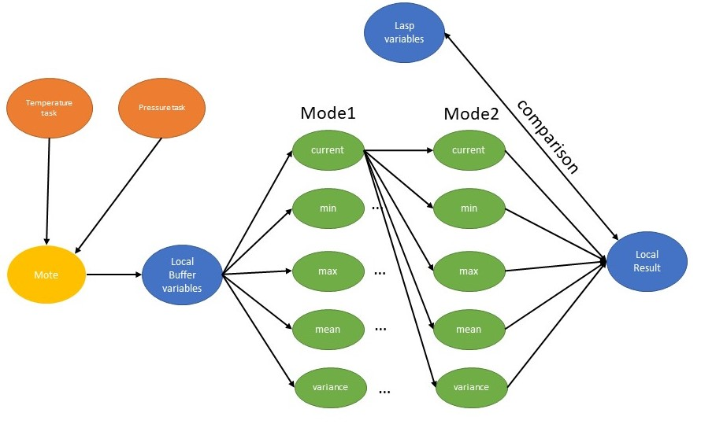

# Documentation
## Disclamer

For now the value from the sensors are random value but you can have the real one by uncommenting the upper code line.

## gworker

When selected {temperature,pressure} task, you can with the arguments Mode1 and Mode2 compute one of the measure combine with another one. 

For example you can compute the global average of the minimum temperature with a local buffer of 5,where there is 1000 ms between each sensors activation and where there is a lower bound and upper bound for temperature value, between all the mote with the same task with the command : 
- gworker:add_task_temp(min,mean,5,1000,-80,100). 

  

### Usage 

Command to initialize the mote : 
- gworker:start_link().
- gworker:add_task_exp().
- gworker:add_task_temp(Mode1,Mode2,Len,SampleRate,LB,UB). % for temperature
- gworker:add_task_press(Mode1,Mode2,Len,SampleRate,LB,UB). % for pressure

With arguments : 
- Mode1      = {current,min,max,mean,variance}
- Mode2      = {current,min,max,mean,variance}
- Len        = Size of the local buffer use for aggregation for each mote
- SampleRate = Duration in ms between each sensors activation
- LB         = Lower bound for the sensor
- UB         = Upper bound for the sensor

## earthquake