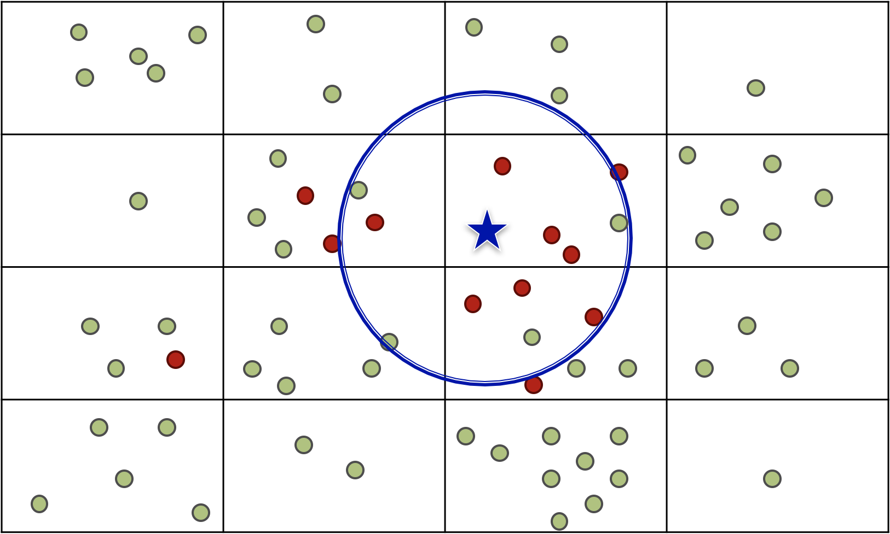

# Documentation
## Disclamer

For now the values from the sensors are random values but you can have the real ones by uncommenting the upper code line.

```erlang
%Temp = pmod_nav:read(acc,[temp_out]),
Temp = rand:uniform(100),
...
%Press = pmod_nav:read(acc,[press_out]),
Press = rand:uniform(100),
...
%% MoveTest = move_detection(-1.5, 1.5),
%% MoveTest = move_detection_deviation(2.0),
MoveTest = move_detection_rand(10,Threshold),
```

## gworker

When selected {temperature,pressure} task, you can with the arguments Mode1 and Mode2 compute one of the measure combine with another one. 

For example you can compute the global average of the minimum temperature with a local buffer of 5, where there is 1000 ms lap between each sensors activation and where there is a lower bound and upper bound for temperature value, between all the mote with the same task with the command : 
- gworker:add_task_temp(min,mean,5,1000,-80,100). 

<p align="center">
  
</p>

### Usage 

Command to initialize the mote : 
- gworker:start_link().
- gworker:add_task_exp().
- gworker:add_task_temp(Mode1,Mode2,Len,SampleRate,LB,UB). % for temperature
- gworker:add_task_press(Mode1,Mode2,Len,SampleRate,LB,UB). % for pressure

With arguments : 
- Mode1      = {current,min,max,mean,variance}
- Mode2      = {current,min,max,mean,variance}
- Len        = Size of the local buffer use for aggregation for each mote
- SampleRate = Duration in ms between each sensors activation
- LB         = Lower bound for the sensor
- UB         = Upper bound for the sensor


## earthquake

The goal of this distributed program is to dectect earthquakes or seismic disturbances using several GRISP boards connected together. Thanks to the sensors we can gather data like 3D accelerometer or gyroscope and process them to detect the slightest movement or vibration.

Each grisp execute a permanent task that will regularly sense the vibrations of the ground. In case of movement detection, the program shares its id with other nodes in the network to inform that a movement has been detected. Since there may be many false positives, an earthquake alert will only be activated if almost all connected nodes have detected a recent movement.


<p align="center">
  
  
</p>


### Usage 

Command to initialize the node: 
- earthquake:start_link().

The task is direcly launched once the command is activated, and is performed permanently in cycle. We can add now several nodes to the task with: 
- achlys_util:add_node('achlys_id').

Nodes display periodically whether an earthquake has been detected globally or not. To access to all CRDT Lasp variables, you must activate the command: 
- earthquake:show(). 

All the nodes that have moved and an earthquake history (hour and minute) will be displayed. Here is the log for one node. The task was distributed on 3 nodes in this example.

```txt
(achlys1@192.168.1.4)1> earthquake:start_link().
{ok,<0.1425.0>}
(achlys1@192.168.1.4)2> "nothing"
"nothing"
"nothing"
"nothing"
"nothing"
"nothing"
earthquake:show().
" "
Number of nodes: 3
Shaking nodes:  ['achlys3@192.168.1.4']
List of earthquakes:  []
Earthquake flag: false
ok
(achlys1@192.168.1.4)3> "nothing"
"nothing"
"nothing"
"nothing"
"nothing"
"nothing"
"nothing"
"nothing"
"nothing"
"nothing"
"Earthquake detected !"
"Earthquake detected !"
"nothing"
"nothing"
"nothing"
earthquake:show().
" "
Number of nodes: 3
Shaking nodes:  ['achlys2@192.168.1.4','achlys3@192.168.1.4']
List of earthquakes:  [{13,26}]
Earthquake flag: false
ok
(achlys1@192.168.1.4)4> "nothing"
"nothing"
"nothing"
...
```
